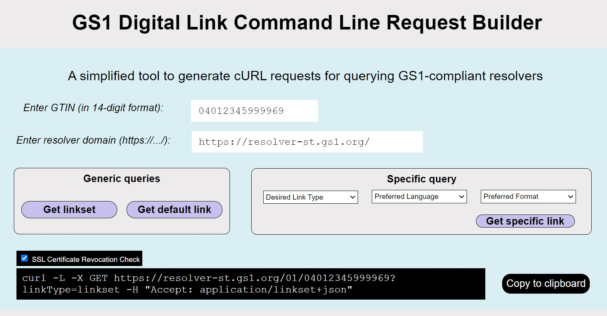

# GS1 Digital Link Command Line Request Builder

 Simplified Web Tool to build GS1 Digital Link Command Line Requests. Enables you to query GS1 Compliant Resolvers with your command line/terminal/console.

## How it works/what to expect

Just insert the resolver endpoint, the GTIN, and which web resource(s) you are interested in. The tool returns you the corresponding command which you can directly copy & paste into the command line/terminal/console.

Access to the tool: <https://ralphtro.github.io/GS1DLCommandLineRequestBuilder/>

## Status

Prototype

## License

 

- Author: Ralph Tröger (<ralph.troeger@gs1.de>)
- Copyright: 2024
- License: Apache-2.0